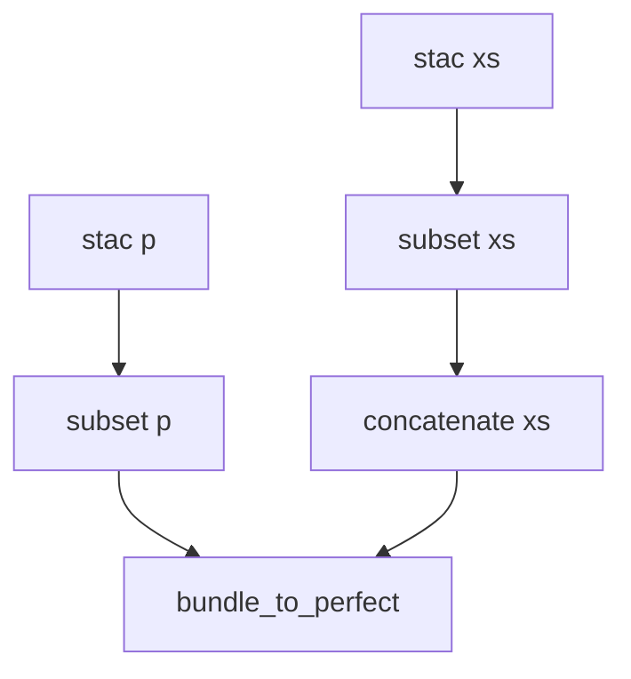

# Landsat-8 pan-sharpening

Pan-sharpening is a technique that combines the high-resolution detail from a panchromatic band with the lower-resolution color information of other bands (usually only the visible bands).

CWL is used to orchestrate the steps required to create a pan-sharpened Landsat-8 RGB composite.


## Steps 

The CWL Workflow steps are depicted as a diagram:



Where: 

- **stac xs** step resolves the Landsat-8 STAC item assets B4, B3, B2 hrefs. These steps are scattered by CWL
- **stac p** step resolves the Landsat-8 STAC item asset B6.
- **subset xs** and **subset p** use GDAL `gdal_translate` to clip the reference COG file to the area of interest (provided as a parameter) 
- **concatenate xs** uses OTB `otbcli_ConcatenateImages` to stack the RGB bands as a single geotiff file
- **bundle_to_perfect** uses OTB `otbcli_BundleToPerfectSensor` to perform the pan-sharpening

### stac xs and stac p

These steps invoke the `asset.cwl` CWL Workflow to resolve the Landsat-8 STAC Item asset href. 

The `CommandLineTool` uses `curl` and `jq` to get the Landsat-8 STAC Item and parse its JSON content:

```yaml
--8<--
otb/landsat-8-mosaic/asset.cwl
--8<--
```

### subset xs and subset p

These steps invoke GDAL's `gdal_translate` to clip the COG to tha area of interest.

```yaml
--8<--
otb/landsat-8-mosaic/translate.cwl
--8<--
```

### concatenate xs

```yaml
--8<--
otb/landsat-8-mosaic/concatenate.cwl
--8<--
```

### bundle_to_perfect

```yaml
--8<--
otb/landsat-8-mosaic/bundle_to_perfect.cwl
--8<--
```

## Worflow

```yaml
--8<--
otb/landsat-8-mosaic/pan-sharpening.cwl
--8<--
```

## Execute the Workflow

The file `pan-sharpening.yml` contains the parameters to invoke the CWL Workflow:

```yaml
--8<--
otb/landsat-8-mosaic/pan-sharpening.yml
--8<--
```

The CWL workflow is executed with:

```console
cwltool --parallel pan-sharpening.cwl pan-sharpening.yml
```

This will output:

```
INFO /srv/conda/bin/cwltool 3.1.20210628163208
INFO Resolved 'pan-sharpening.cwl' to 'file:///home/fbrito/work/guide/docs/otb/landsat-8-pan-sharpening/pan-sharpening.cwl'
INFO [workflow ] starting step node_stac_p
INFO [step node_stac_p] start
INFO [workflow ] start
INFO [workflow ] starting step node_stac_xs
INFO [step node_stac_xs] start
INFO [step node_stac_xs] start
INFO [step node_stac_xs] start
INFO [job node_stac_p] /tmp/ocp1fize$ docker \
    run \
    -i \
    --mount=type=bind,source=/tmp/ocp1fize,target=/SylLdp \
    --mount=type=bind,source=/tmp/rdlm1sb2,target=/tmp \
    --workdir=/SylLdp \
    --read-only=true \
    --log-driver=none \
    --user=1000:1000 \
    --rm \
    --cidfile=/tmp/_yul_u6l/20210804173603-213866.cid \
    --env=TMPDIR=/tmp \
    --env=HOME=/SylLdp \
    terradue/jq \
    /bin/sh \
    -c \
    'curl' '-s' 'https://landsat-stac.s3.amazonaws.com/landsat-8-l1/189/034/2020-04-27/LC81890342020118.json' | 'jq' '.assets.B8.href' | 'tr' '-d' \" > /tmp/ocp1fize/message
INFO [job node_stac_xs] /tmp/5hactbmn$ docker \
    run \
    -i \
    --mount=type=bind,source=/tmp/5hactbmn,target=/SylLdp \
    --mount=type=bind,source=/tmp/jes964z4,target=/tmp \
    --workdir=/SylLdp \
    --read-only=true \
    --log-driver=none \
    --user=1000:1000 \
    --rm \
    --cidfile=/tmp/hj367hhm/20210804173603-232079.cid \
    --env=TMPDIR=/tmp \
    --env=HOME=/SylLdp \
    terradue/jq \
    /bin/sh \
    -c \
    'curl' '-s' 'https://landsat-stac.s3.amazonaws.com/landsat-8-l1/189/034/2020-04-27/LC81890342020118.json' | 'jq' '.assets.B4.href' | 'tr' '-d' \" > /tmp/5hactbmn/message
INFO [job node_stac_xs_2] /tmp/em8f13in$ docker \
    run \
    -i \
    --mount=type=bind,source=/tmp/em8f13in,target=/SylLdp \
    --mount=type=bind,source=/tmp/88eyxi1x,target=/tmp \
    --workdir=/SylLdp \
    --read-only=true \
    --log-driver=none \
    --user=1000:1000 \
    --rm \
    --cidfile=/tmp/tbsqgf5p/20210804173603-235855.cid \
    --env=TMPDIR=/tmp \
    --env=HOME=/SylLdp \
    terradue/jq \
    /bin/sh \
    -c \
    'curl' '-s' 'https://landsat-stac.s3.amazonaws.com/landsat-8-l1/189/034/2020-04-27/LC81890342020118.json' | 'jq' '.assets.B3.href' | 'tr' '-d' \" > /tmp/em8f13in/message
INFO [job node_stac_xs_3] /tmp/xd0fmqxi$ docker \
    run \
    -i \
    --mount=type=bind,source=/tmp/xd0fmqxi,target=/SylLdp \
    --mount=type=bind,source=/tmp/2clk49jo,target=/tmp \
    --workdir=/SylLdp \
    --read-only=true \
    --log-driver=none \
    --user=1000:1000 \
    --rm \
    --cidfile=/tmp/v7kn3_ek/20210804173603-242940.cid \
    --env=TMPDIR=/tmp \
    --env=HOME=/SylLdp \
    terradue/jq \
    /bin/sh \
    -c \
    'curl' '-s' 'https://landsat-stac.s3.amazonaws.com/landsat-8-l1/189/034/2020-04-27/LC81890342020118.json' | 'jq' '.assets.B2.href' | 'tr' '-d' \" > /tmp/xd0fmqxi/message
INFO [job node_stac_xs] Max memory used: 0MiB
INFO [job node_stac_xs_2] Max memory used: 0MiB
INFO [job node_stac_p] Max memory used: 0MiB
INFO [job node_stac_xs_3] Max memory used: 0MiB
INFO [job node_stac_xs] completed success
INFO [job node_stac_xs_2] completed success
INFO [job node_stac_p] completed success
INFO [step node_stac_p] completed success
INFO [workflow ] starting step node_subset_p
INFO [step node_subset_p] start
INFO [job node_stac_xs_3] completed success
INFO [step node_stac_xs] completed success
INFO [workflow ] starting step node_subset_xs
INFO [step node_subset_xs] start
INFO [step node_subset_xs] start
INFO [step node_subset_xs] start
INFO [job node_subset_p] /tmp/3zglf_2v$ docker \
    run \
    -i \
    --mount=type=bind,source=/tmp/3zglf_2v,target=/SylLdp \
    --mount=type=bind,source=/tmp/0r8_x_fp,target=/tmp \
    --workdir=/SylLdp \
    --read-only=true \
    --log-driver=none \
    --user=1000:1000 \
    --rm \
    --cidfile=/tmp/rq8yfpxp/20210804173606-799825.cid \
    --env=TMPDIR=/tmp \
    --env=HOME=/SylLdp \
    osgeo/gdal \
    gdal_translate \
    -projwin \
    13.024 \
    38.247 \
    14.7 \
    36.69 \
    -projwin_srs \
    EPSG:4326 \
    /vsicurl/https://landsat-pds.s3.amazonaws.com/c1/L8/189/034/LC08_L1TP_189034_20200427_20200509_01_T1/LC08_L1TP_189034_20200427_20200509_01_T1_B8.TIF \
    LC08_L1TP_189034_20200427_20200509_01_T1_B8.tif > /tmp/3zglf_2v/stdout 2> /tmp/3zglf_2v/stderr
INFO [job node_subset_xs_3] /tmp/stcmw6jr$ docker \
    run \
    -i \
    --mount=type=bind,source=/tmp/stcmw6jr,target=/SylLdp \
    --mount=type=bind,source=/tmp/3hvmk29c,target=/tmp \
    --workdir=/SylLdp \
    --read-only=true \
    --log-driver=none \
    --user=1000:1000 \
    --rm \
    --cidfile=/tmp/vu17p2ii/20210804173606-835032.cid \
    --env=TMPDIR=/tmp \
    --env=HOME=/SylLdp \
    osgeo/gdal \
    gdal_translate \
    -projwin \
    13.024 \
    38.247 \
    14.7 \
    36.69 \
    -projwin_srs \
    EPSG:4326 \
    /vsicurl/https://landsat-pds.s3.amazonaws.com/c1/L8/189/034/LC08_L1TP_189034_20200427_20200509_01_T1/LC08_L1TP_189034_20200427_20200509_01_T1_B2.TIF \
    LC08_L1TP_189034_20200427_20200509_01_T1_B2.tif > /tmp/stcmw6jr/stdout 2> /tmp/stcmw6jr/stderr
INFO [job node_subset_xs] /tmp/qyw2_zpj$ docker \
    run \
    -i \
    --mount=type=bind,source=/tmp/qyw2_zpj,target=/SylLdp \
    --mount=type=bind,source=/tmp/i_rk2a9p,target=/tmp \
    --workdir=/SylLdp \
    --read-only=true \
    --log-driver=none \
    --user=1000:1000 \
    --rm \
    --cidfile=/tmp/l0jw9g8d/20210804173606-884892.cid \
    --env=TMPDIR=/tmp \
    --env=HOME=/SylLdp \
    osgeo/gdal \
    gdal_translate \
    -projwin \
    13.024 \
    38.247 \
    14.7 \
    36.69 \
    -projwin_srs \
    EPSG:4326 \
    /vsicurl/https://landsat-pds.s3.amazonaws.com/c1/L8/189/034/LC08_L1TP_189034_20200427_20200509_01_T1/LC08_L1TP_189034_20200427_20200509_01_T1_B4.TIF \
    LC08_L1TP_189034_20200427_20200509_01_T1_B4.tif > /tmp/qyw2_zpj/stdout 2> /tmp/qyw2_zpj/stderr
INFO [job node_subset_xs_2] /tmp/ec2vd8nr$ docker \
    run \
    -i \
    --mount=type=bind,source=/tmp/ec2vd8nr,target=/SylLdp \
    --mount=type=bind,source=/tmp/zv9w9ay4,target=/tmp \
    --workdir=/SylLdp \
    --read-only=true \
    --log-driver=none \
    --user=1000:1000 \
    --rm \
    --cidfile=/tmp/nek1kq3w/20210804173606-950912.cid \
    --env=TMPDIR=/tmp \
    --env=HOME=/SylLdp \
    osgeo/gdal \
    gdal_translate \
    -projwin \
    13.024 \
    38.247 \
    14.7 \
    36.69 \
    -projwin_srs \
    EPSG:4326 \
    /vsicurl/https://landsat-pds.s3.amazonaws.com/c1/L8/189/034/LC08_L1TP_189034_20200427_20200509_01_T1/LC08_L1TP_189034_20200427_20200509_01_T1_B3.TIF \
    LC08_L1TP_189034_20200427_20200509_01_T1_B3.tif > /tmp/ec2vd8nr/stdout 2> /tmp/ec2vd8nr/stderr
INFO [job node_subset_xs_2] Max memory used: 140MiB
INFO [job node_subset_xs_2] completed success
INFO [job node_subset_xs_3] Max memory used: 140MiB
INFO [job node_subset_xs_3] completed success
INFO [job node_subset_xs] Max memory used: 140MiB
INFO [job node_subset_xs] completed success
INFO [step node_subset_xs] completed success
INFO [workflow ] starting step node_concatenate
INFO [step node_concatenate] start
INFO [job node_concatenate] /tmp/knf2r9sb$ docker \
    run \
    -i \
    --mount=type=bind,source=/tmp/knf2r9sb,target=/SylLdp \
    --mount=type=bind,source=/tmp/57egskol,target=/tmp \
    --mount=type=bind,source=/tmp/qyw2_zpj/LC08_L1TP_189034_20200427_20200509_01_T1_B4.tif,target=/var/lib/cwl/stgc5780791-8645-4e2c-9836-0d0ad562f697/LC08_L1TP_189034_20200427_20200509_01_T1_B4.tif,readonly \
    --mount=type=bind,source=/tmp/ec2vd8nr/LC08_L1TP_189034_20200427_20200509_01_T1_B3.tif,target=/var/lib/cwl/stg8b191124-00d3-441d-ab72-d0e74d86f48a/LC08_L1TP_189034_20200427_20200509_01_T1_B3.tif,readonly \
    --mount=type=bind,source=/tmp/stcmw6jr/LC08_L1TP_189034_20200427_20200509_01_T1_B2.tif,target=/var/lib/cwl/stgc634f2d6-acea-4c0d-9b56-37887c74cdc7/LC08_L1TP_189034_20200427_20200509_01_T1_B2.tif,readonly \
    --workdir=/SylLdp \
    --read-only=true \
    --log-driver=none \
    --user=1000:1000 \
    --rm \
    --cidfile=/tmp/3cqq714a/20210804173912-369708.cid \
    --env=TMPDIR=/tmp \
    --env=HOME=/SylLdp \
    terradue/otb-7.2.0 \
    otbcli_ConcatenateImages \
    -out \
    xs_stack.tif \
    -il \
    /var/lib/cwl/stgc5780791-8645-4e2c-9836-0d0ad562f697/LC08_L1TP_189034_20200427_20200509_01_T1_B4.tif \
    /var/lib/cwl/stg8b191124-00d3-441d-ab72-d0e74d86f48a/LC08_L1TP_189034_20200427_20200509_01_T1_B3.tif \
    /var/lib/cwl/stgc634f2d6-acea-4c0d-9b56-37887c74cdc7/LC08_L1TP_189034_20200427_20200509_01_T1_B2.tif > /tmp/knf2r9sb/stdout 2> /tmp/knf2r9sb/stderr
INFO [job node_concatenate] Max memory used: 0MiB
INFO [job node_concatenate] completed success
INFO [step node_concatenate] completed success
INFO [job node_subset_p] Max memory used: 479MiB
INFO [job node_subset_p] completed success
INFO [step node_subset_p] completed success
INFO [workflow ] starting step node_bundle_to_perfect
INFO [step node_bundle_to_perfect] start
INFO [job node_bundle_to_perfect] /tmp/ax28u_oo$ docker \
    run \
    -i \
    --mount=type=bind,source=/tmp/ax28u_oo,target=/SylLdp \
    --mount=type=bind,source=/tmp/mwg_945e,target=/tmp \
    --mount=type=bind,source=/tmp/3zglf_2v/LC08_L1TP_189034_20200427_20200509_01_T1_B8.tif,target=/var/lib/cwl/stge8932e00-551b-4600-bcc9-d1301605dceb/LC08_L1TP_189034_20200427_20200509_01_T1_B8.tif,readonly \
    --mount=type=bind,source=/tmp/knf2r9sb/xs_stack.tif,target=/var/lib/cwl/stg04227d2f-7f21-4ae5-82e1-2307f645229b/xs_stack.tif,readonly \
    --workdir=/SylLdp \
    --read-only=true \
    --log-driver=none \
    --user=1000:1000 \
    --rm \
    --cidfile=/tmp/fzdpqofo/20210804174224-963566.cid \
    --env=TMPDIR=/tmp \
    --env=HOME=/SylLdp \
    terradue/otb-7.2.0 \
    otbcli_BundleToPerfectSensor \
    -out \
    pan-sharpen.tif \
    -inxs \
    /var/lib/cwl/stg04227d2f-7f21-4ae5-82e1-2307f645229b/xs_stack.tif \
    -inp \
    /var/lib/cwl/stge8932e00-551b-4600-bcc9-d1301605dceb/LC08_L1TP_189034_20200427_20200509_01_T1_B8.tif > /tmp/ax28u_oo/stdout 2> /tmp/ax28u_oo/stderr
INFO [job node_bundle_to_perfect] Max memory used: 831MiB
INFO [job node_bundle_to_perfect] completed success
INFO [step node_bundle_to_perfect] completed success
INFO [workflow ] completed success
{
    "ps_tif": {
        "location": "file:///home/fbrito/work/guide/docs/otb/landsat-8-pan-sharpening/pan-sharpen.tif",
        "basename": "pan-sharpen.tif",
        "class": "File",
        "checksum": "sha1$d0d333d4ef042f77df8f8f9e5fef7d540fa2a107",
        "size": 1360248796,
        "path": "/home/fbrito/work/guide/docs/otb/landsat-8-pan-sharpening/pan-sharpen.tif"
    }
}
INFO Final process status is success
```