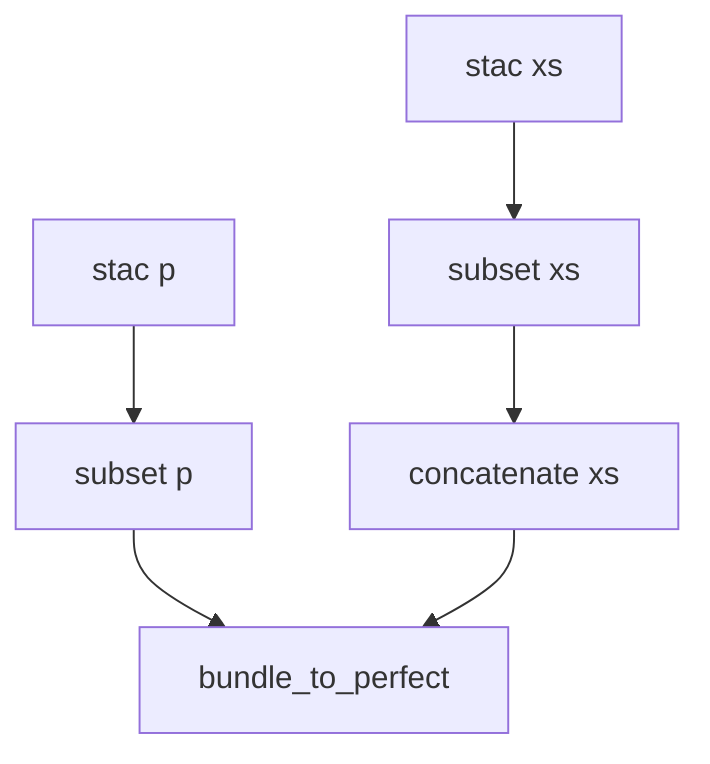

# Landsat-8 pan-sharpening

Pan-sharpening is a technique that combines the high-resolution detail from a panchromatic band with the lower-resolution color information of other bands (usually only the visible bands).

CWL is used to orchestrate the steps required to create a pan-sharpened Landsat-8 RGB composite.


## Steps 

The CWL Workflow steps are depicted as a diagram:



Where: 

- **stac xs** step resolves the Landsat-8 STAC item assets B4, B3, B2 hrefs. These steps are scattered by CWL
- **stac p** step resolves the Landsat-8 STAC item asset B6.
- **subset xs** and **subset p** use GDAL `gdal_translate` to clip the reference COG file to the area of interest (provided as a parameter) 
- **concatenate xs** uses OTB `otbcli_ConcatenateImages` to stack the RGB bands as a single geotiff file
- **bundle_to_perfect** uses OTB `otbcli_BundleToPerfectSensor` to perform the pan-sharpening

### stac xs and stac p

These steps invoke the `asset.cwl` CWL Workflow to resolve the Landsat-8 STAC Item asset href. 

The `CommandLineTool` uses `curl` and `jq` to get the Landsat-8 STAC Item and parse its JSON content:

```yaml
--8<--
otb/landsat-8-mosaic/asset.cwl
--8<--
```

### subset xs and subset p

These steps invoke GDAL's `gdal_translate` to clip the COG to tha area of interest.

```yaml
--8<--
otb/landsat-8-mosaic/translate.cwl
--8<--

```

### concatenate xs

```yaml
--8<--
otb/landsat-8-mosaic/concatenate.cwl
--8<--
```

### bundle_to_perfect

```yaml
--8<--
otb/landsat-8-mosaic/bundle_to_perfect.cwl
--8<--
```

## Worflow

```yaml
--8<--
otb/landsat-8-mosaic/pan-sharpening.cwl
--8<--
```

## Execute the Workflow

The file `pan-sharpening.yml` contains the parameters to invoke the CWL Workflow:

```yaml
--8<--
otb/landsat-8-mosaic/pan-sharpening.yml
--8<--
```

The CWL workflow is executed with:

```console
cwltool --parallel pan-sharpening.cwl pan-sharpening.yml
```
