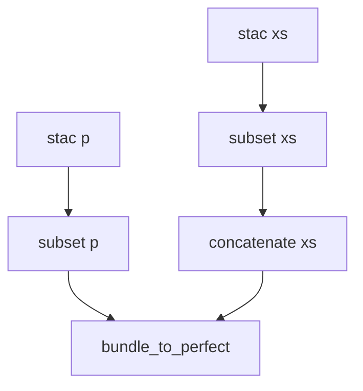

# Landsat-8 pan-sharpening

Pan-sharpening is a technique that combines the high-resolution detail from a panchromatic band with the lower-resolution color information of other bands (usually only the visible bands).

CWL is used to orchestrate the steps required to create a pan-sharpened Landsat-8 RGB composite.

These steps are described as a diagram:



```
--8<-- "otb/landsat-8-mosaic/asset.cwl"
```

```yaml
--8<--
otb/landsat-8-mosaic/asset.cwl
--8<--
```

--8<--
otb/landsat-8-mosaic/asset.cwl
--8<--
